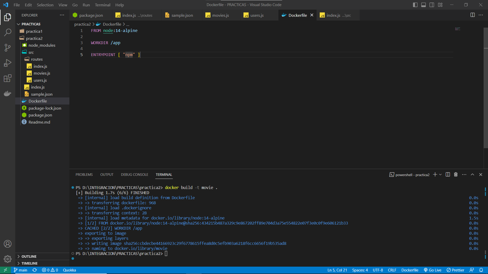
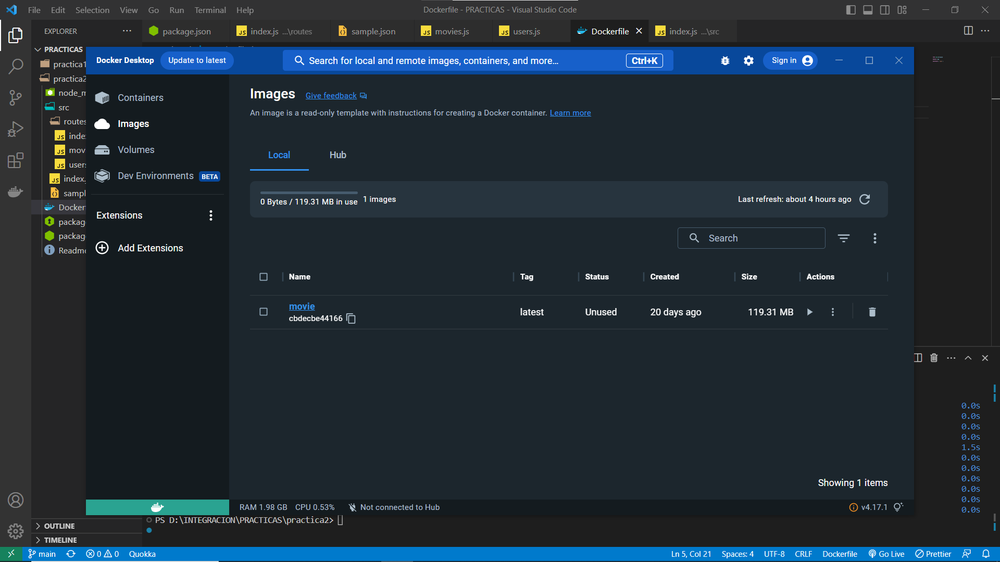
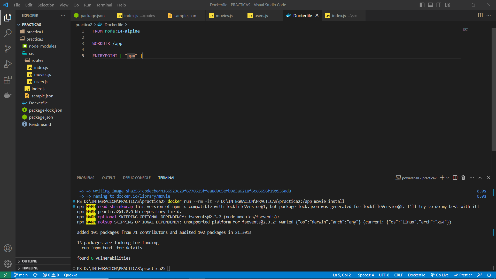
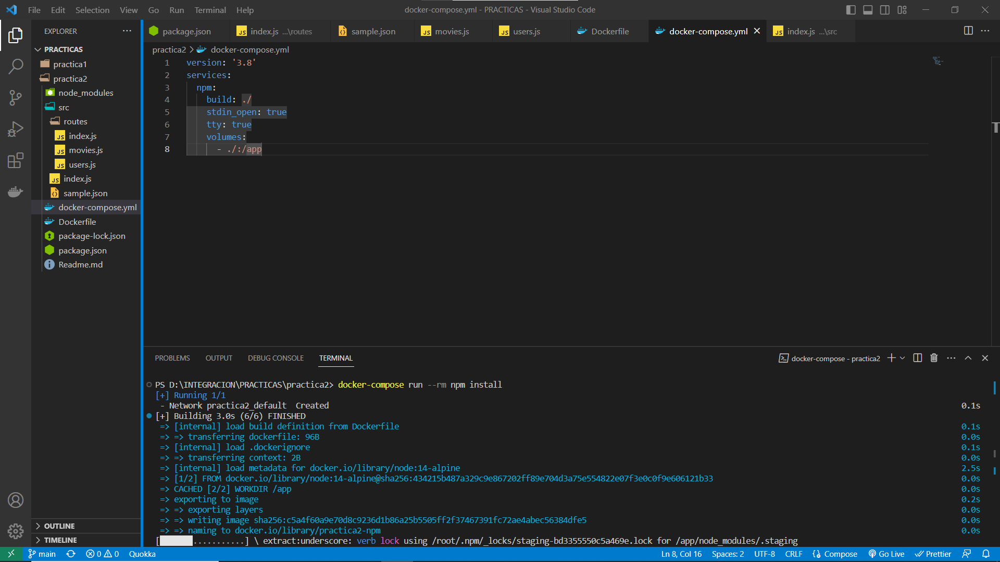
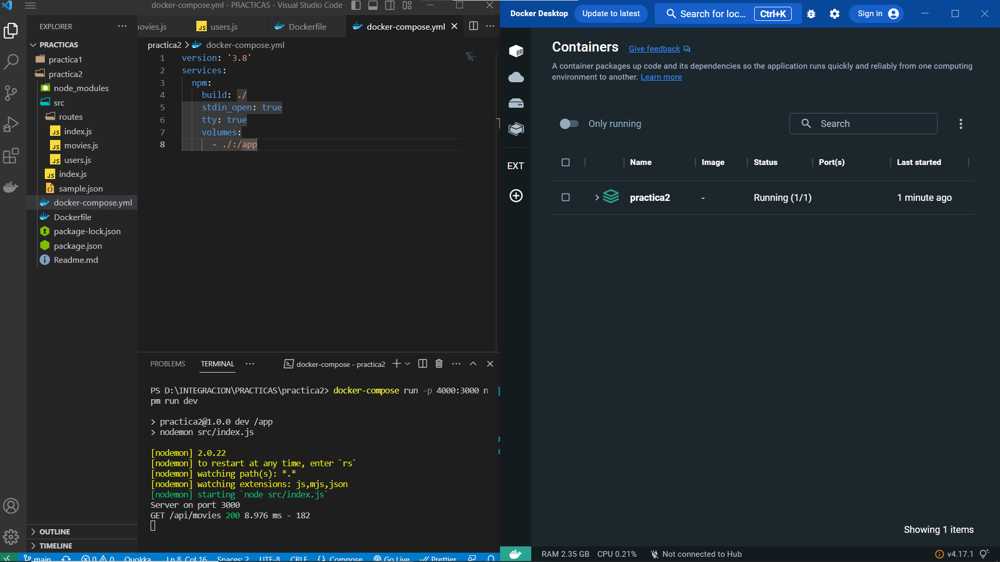
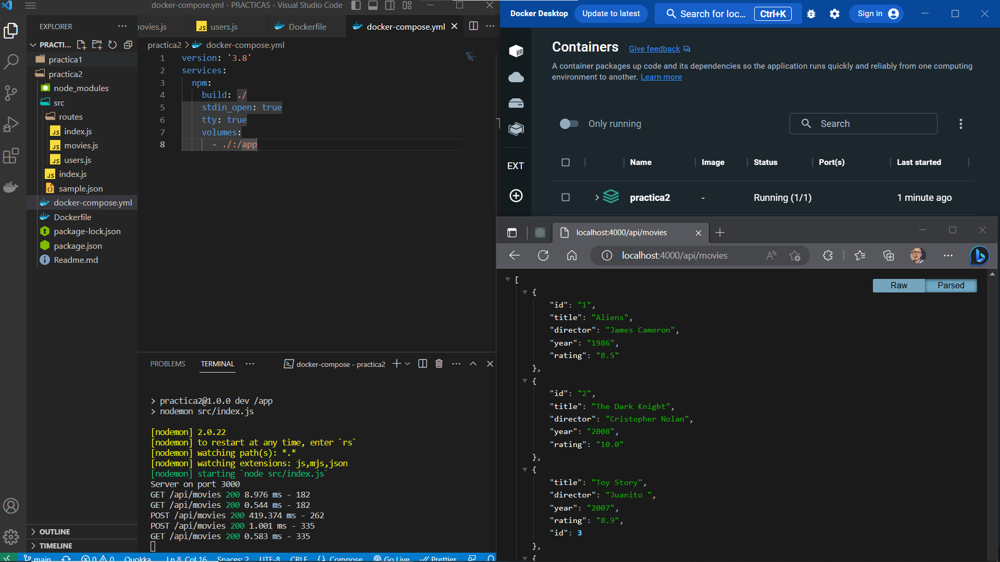

# PRACTICA 2
## creamos imagen
1. Hacemos uso del siguiente comando

2. Imagen creada

## descargamos sus respectivas dependencias
1. dockerfile

2. docker-compose

## ejecutamos imagen en contenedor
1. vista general

2. vista navegador
