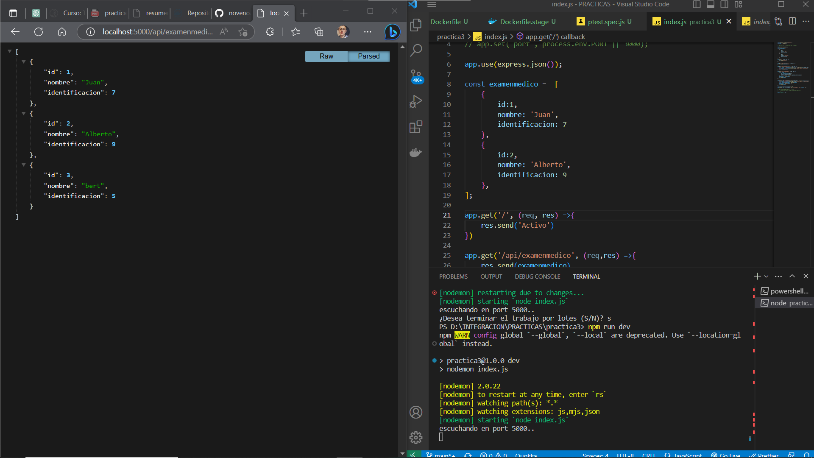
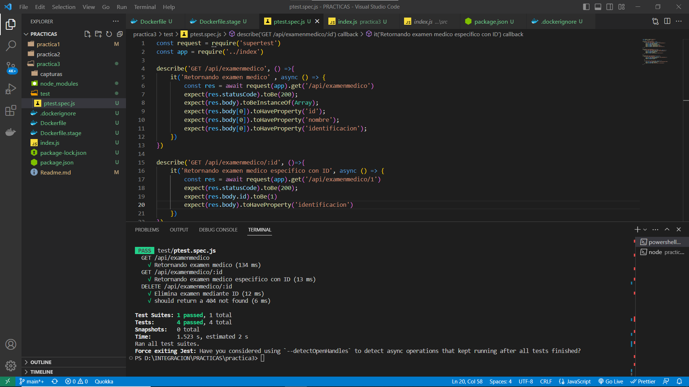
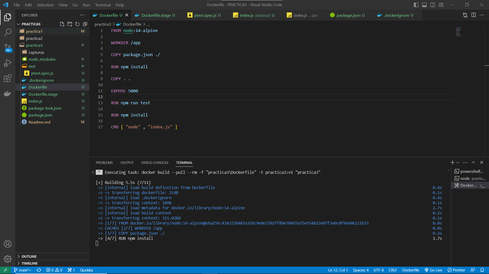
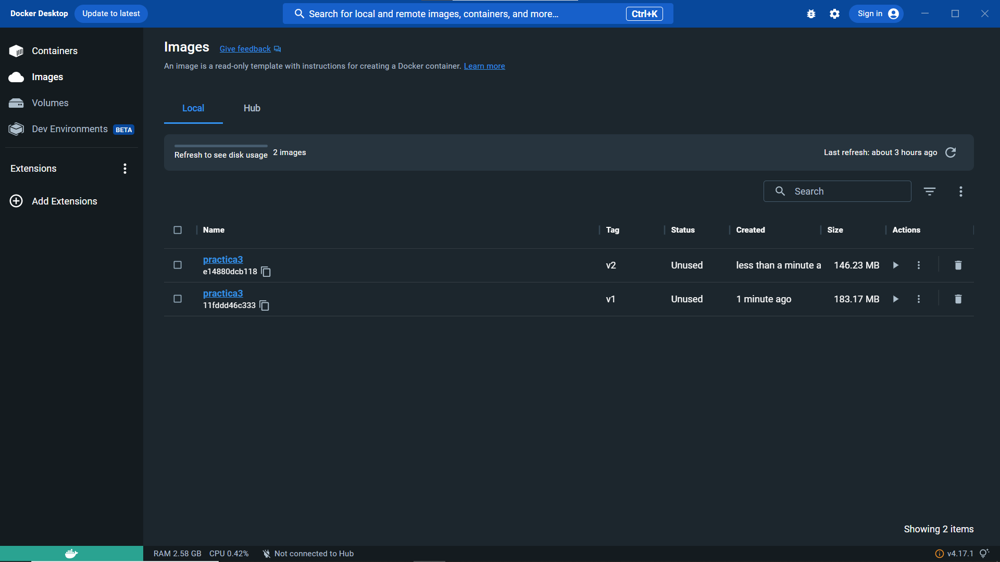
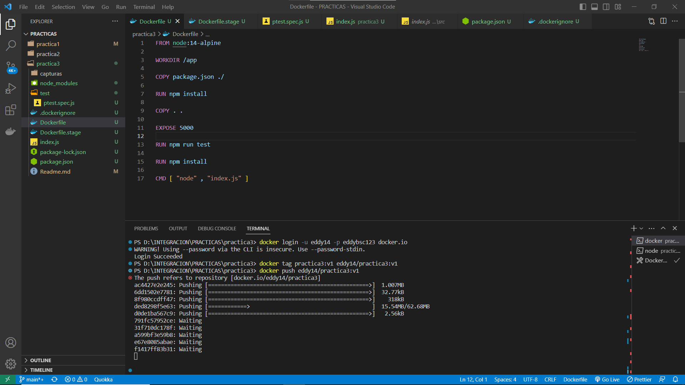
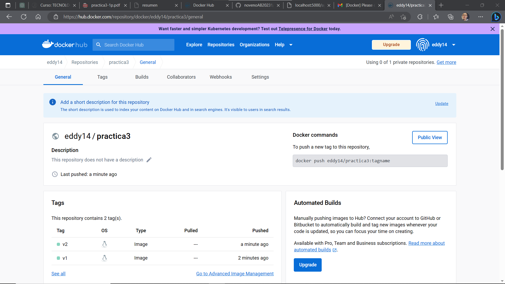
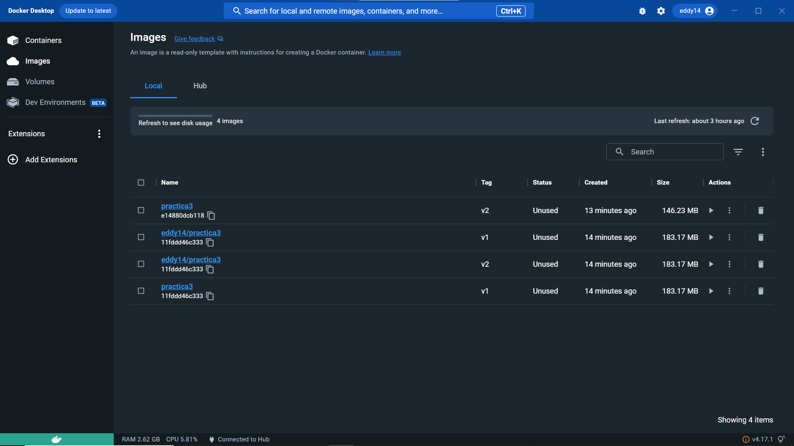
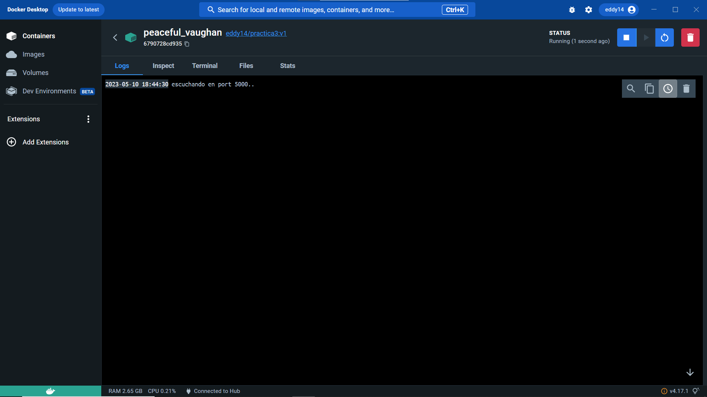
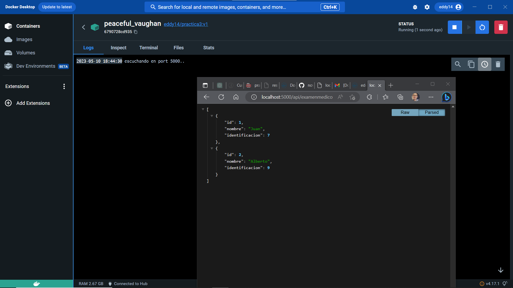

# PRACTICA 3
## iniciamos servicio

## corremos las pruebas test

## creamos las imagenes

## imagenes creadas

## inicamos sesion en el docker, hacemos los tag y push para ambas versiones

## docker hub

## imagenes creadas en el docker desktop

## corriendo imagen

